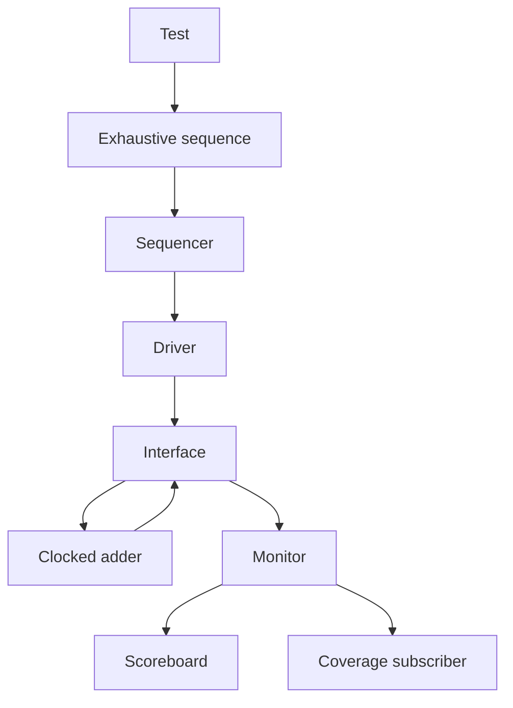

# UVM Verification of a 4-Bit Adder

A SystemVerilog/UVM learning project that verifies a clocked 4-bit unsigned adder using exhaustive stimulus, a self-checking scoreboard, and functional coverage.

**Recorded result: 256 checks passed, 0 failed, and 100% of the defined functional coverage was reached.** The simulation ran on EDA Playground using Synopsys VCS and UVM 1.2.

## Why I built this project

I started learning SystemVerilog and UVM by studying an existing EDA Playground adder example. I used that example as a blueprint to rewrite the UVM environment myself, with guidance and debugging support during the learning process.

My goal was to understand enough to write my own verification environment and develop Design Verification skills. This included understanding what to test, how to check the results, and how to measure whether the intended scenarios had occurred.

A verification planning table guided my implementation. From that table, I chose to exercise every input pair and added coverage for input values, sums, carry behaviour, and the A×B cross. This project documents the connection between that plan, the testbench implementation, and the simulation results.

## Design under test

The `ADDER` module has the following ports:

| Port | Direction | Width | Description |
|---|---|---:|---|
| `clk` | Input | 1 | Clock; the result updates on the rising edge |
| `reset` | Input | 1 | Active-high asynchronous reset |
| `A` | Input | 4 | Unsigned operand, 0–15 |
| `B` | Input | 4 | Unsigned operand, 0–15 |
| `Sum` | Output | 5 | Registered result, 0–30 during normal addition |

When reset is asserted, `Sum` is cleared to zero. Otherwise, at each rising clock edge:

```systemverilog
Sum <= {1'b0, A} + {1'b0, B};
```

The operands are extended to five bits so that the result retains the carry. For example, `15 + 15 = 30` requires five result bits.

## Verification strategy

### From a reference example to a planned test

The random-stimulus approach discussed during my learning generates transactions by randomizing the operands. Repeating this 256 times does not guarantee 256 distinct input pairs: some pairs may repeat and others may never occur.

For this DUT, exhaustive input testing is practical:

- `A` has 16 possible values.
- `B` has 16 possible values.
- There are `16 × 16 = 256` possible ordered input pairs.

I therefore used an `exhaustive_sequence` with nested loops to generate each pair once:

```systemverilog
for (int i = 0; i < 16; i++) begin
  for (int j = 0; j < 16; j++) begin
    req = seq_item::type_id::create("req");
    start_item(req);
    req.a = i;
    req.b = j;
    finish_item(req);
  end
end
```

### Stimulus, checking, and coverage

These serve three different purposes in the environment:

| Part | Purpose |
|---|---|
| Exhaustive sequence | Generates all 256 input pairs |
| Scoreboard | Calculates the expected sum and compares it with the observed result |
| Coverage subscriber | Records the input values, input pairs, sums, and carry values observed by the monitor |

The scoreboard calculates a five-bit expected result using the monitored operands. A matching result increments the pass count; a mismatch increments the fail count and reports a UVM error.

### Corner cases

The planning table includes `0+0`, zero operands, and maximum inputs. I did not add separate named coverage bins for each of these scenarios because they are already represented in the exhaustive stimulus and A×B cross:

- `0+0` is the cross pair `(0,0)`.
- `15+15` is the cross pair `(15,15)`.
- `0+x` and `x+0` are the pairs where either operand is zero.

The scoreboard checks their arithmetic results just like every other transaction. Separate named corner-case bins could make a report easier to read, but they are not needed to establish that these pairs occurred when all 256 cross bins are hit.

See [the verification plan](docs/verification-plan.md) for the complete requirement-to-implementation mapping.

## UVM environment



The agent contains the sequencer, driver, and monitor. The environment contains the agent, scoreboard, and coverage subscriber. The monitor broadcasts observed transactions to both checking and coverage components.

| Source file | Responsibility |
|---|---|
| `adder.sv` | Clocked adder RTL |
| `interface.sv` | Signals, driver/monitor clocking blocks, and modports |
| `seq_item.sv` | Transaction fields |
| `sequence.sv` | Exhaustive input-pair generation |
| `sequencer.sv` | Supplies sequence items to the driver |
| `driver.sv` | Drives operands through the virtual interface |
| `monitor.sv` | Samples operands and result and publishes transactions |
| `scoreboard.sv` | Checks addition and reports pass/fail counts |
| `coverage.sv` | Samples and reports functional coverage |
| `agent.sv` | Builds and connects the sequencer, driver, and monitor |
| `environment.sv` | Builds the agent, scoreboard, and coverage subscriber and connects analysis paths |
| `adder_test.sv` | Starts the sequence and controls test completion |
| `testbench.sv` | Includes source files, instantiates the DUT/interface, generates clock/reset, configures virtual interfaces, and starts UVM |
| `design.sv` | Empty in the successful EDA Playground export; RTL is included by `testbench.sv` |

### Timing and transaction collection

The testbench generates a 10 ns clock. The driver places operands on the falling edge. The DUT registers their sum on the next rising edge. At the following falling edge, the monitor samples the completed operation.

The monitor clocking block uses `input #1step` so it observes the values just before the driver updates the next transaction. The interface also carries a testbench-only `valid` signal to prevent collecting transactions before stimulus begins. This signal is not a DUT handshake port.

The test keeps its UVM objection raised until the scoreboard has processed 256 transactions. This ensures that the final driven transaction is checked before the test finishes.

## Functional coverage

| Coverage item | Implementation | Target |
|---|---|---:|
| All A values | `val_A` | 16 bins, 0–15 |
| All B values | `val_B` | 16 bins, 0–15 |
| All legal sums | `val_sum` | 31 bins, 0–30 |
| Carry / no carry | `val_carry` on `sum[4]` | 2 bins |
| Every ordered A×B pair | `combi` cross | 256 cross bins |

The sum coverpoint also declares `31` as an illegal value because the maximum legal result is `15+15=30`.

Coverage is sampled from monitored transactions. Coverage measures which scenarios occurred; the scoreboard determines whether the arithmetic result was correct.

## Simulation results

The supplied EDA Playground console log reports:

```text
FINAL COVERAGE = 100.00 %
FINAL SCOREBOARD: PASS=256 FAIL=0 TOTAL=256

UVM_WARNING :    0
UVM_ERROR :      0
UVM_FATAL :      0
```

| Item | Recorded result |
|---|---:|
| Scoreboard checks | 256 |
| Passed | 256 |
| Failed | 0 |
| Defined functional coverage | 100.00% |
| UVM warnings / errors / fatals | 0 / 0 / 0 |

These results demonstrate successful arithmetic checking across every 4-bit input pair under the timing used by this testbench. The 100% figure refers to this project's functional coverage model; it is not a code-coverage result or proof of every possible temporal behaviour.

## Running the project

The successful export used **Synopsys VCS X-2025.06-SP1** with **UVM 1.2** on EDA Playground.

To reproduce the source arrangement:

1. Select SystemVerilog, UVM 1.2, and an available VCS simulator in EDA Playground.
2. Put the exported `testbench.sv` content in the testbench pane.
3. Add the other `.sv` source files listed above as additional files, preserving their names.
4. Leave `design.sv` empty: `testbench.sv` already includes `adder.sv` and the UVM files.
5. Run the simulation and inspect the final scoreboard, coverage, and UVM summary.

Preserve the flat source layout of the working export when following these instructions. If the files are moved into `rtl/` and `tb/` folders, update the include paths accordingly. Avoid compiling included definitions a second time.

My initial attempt to run the project in Questa Altera Starter Edition encountered compilation problems. The successful run documented here was performed on EDA Playground. This does not establish a general limitation of Questa or claim successful local Questa execution.

## Current scope and future improvements

The completed milestone is exhaustive arithmetic verification after startup reset. Reset is applied to initialize the DUT, but dedicated reset checks and reset coverage are not demonstrated by the reported results.

Possible extensions include:

- Checking asynchronous reset assertion and reset during active stimulus.
- Adding a timeout so a stalled test reports a clear failure.
- Handling stimulus gaps explicitly through the testbench `valid` signal.
- Injecting a deliberate DUT error to demonstrate that the scoreboard detects it.
- Adding assertions for selected timing and reset requirements.

## What I learned

This project gave me practice with UVM component structure, sequence–driver communication, virtual interfaces, clocking blocks, analysis connections, scoreboarding, and functional coverage.

It also gave me an initial verification workflow: identify the required behaviours, choose stimulus, implement checking and coverage, run the simulation, and compare the evidence against the plan.

## Acknowledgements

I used an existing [EDA Playground UVM adder example](https://www.edaplayground.com/x/4XrP) as a learning reference and architectural blueprint. That link identifies the reference example, not a published link to this project's completed run.

I rewrote the environment as a learning exercise with guided explanations and debugging assistance. The verification planning table guided my choice of exhaustive stimulus and coverage. This repository records that adaptation and learning process; it does not claim that the original example's architecture was invented here.
